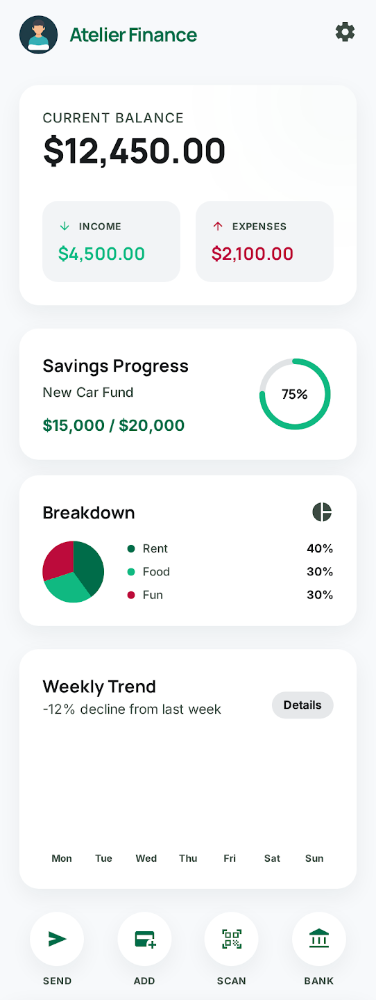
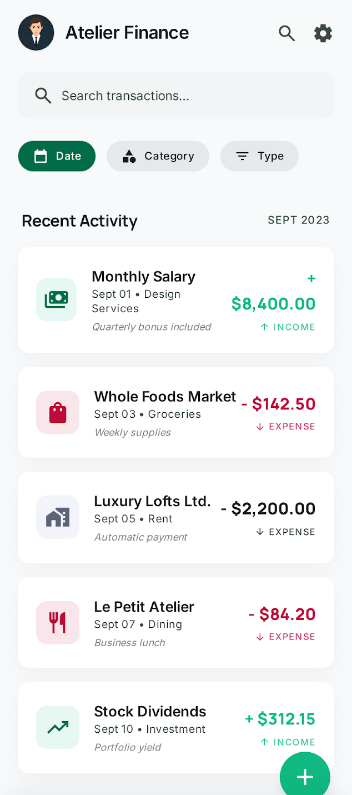
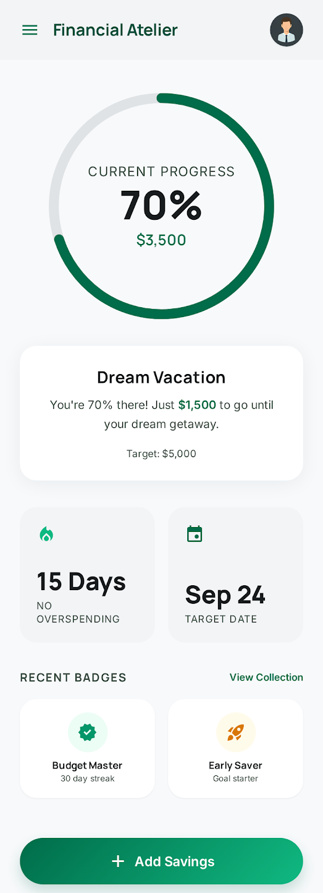
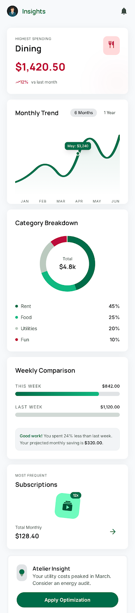
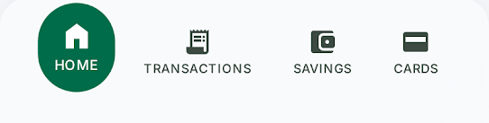

# 📱 Personal Finance Tracker App

A mobile-first personal finance application designed to help users **track, understand, and improve their financial habits** through an intuitive and structured experience.

---

## 🚀 Overview

This application provides users with a **centralized dashboard**, **transaction management system**, and **insightful analytics** to monitor their financial activity effectively.

The goal of this project is to demonstrate:

* Strong **mobile UI/UX design thinking**
* Clean and scalable **architecture**
* Practical **state & data management**
* Product-oriented feature development

---

## ✨ Features

### 🏠 1. Home Dashboard


A clean and informative dashboard that gives users a quick overview of their finances.

**Includes:**

* Current balance
* Total income
* Total expenses
* Savings overview

**Visual Elements:**

* Spending chart / category breakdown *(implemented)*
* Weekly trends *(partially implemented / extendable)*

Designed to provide clarity without overwhelming the user.

---

### 💸 2. Transaction Tracking


A complete system to manage financial records.

**Each transaction includes:**

* Amount
* Type (Income / Expense)
* Category
* Date
* Notes

**Functionalities:**

* ➕ Add transaction
* 📜 View history
* ✏️ Edit transaction
* 🗑️ Delete transaction
* 🔍 Filter & search *(basic implementation, can be enhanced)*

Focus: Smooth data entry flow and structured list handling.

---

### 🎯 3. Goal / Challenge Feature


A product-oriented feature to improve engagement.

**Implemented Concept:**

* Savings goal / budgeting tracker *(customizable)*

**Purpose:**
Encourages users to build better financial habits through goal tracking.

> This feature is designed to be extensible (e.g., streak systems, alerts, or challenges).

---

### 📊 4. Insights Screen


Provides users with meaningful financial analysis.

**Includes:**

* Spending by category
* Monthly / weekly trends *(basic support implemented)*
* High-level summaries

Focus: Presenting useful data clearly on small screens.

---

### 📱 5. Mobile UX Considerations


* Smooth navigation between screens
* Clean screen hierarchy
* Touch-friendly UI components
* Structured forms for input
* Basic empty states handling

> Some advanced UX states like loading/error handling can be further refined.

---

### 💾 6. Data Handling

* Uses **mock data layer**
* Designed with a **scalable data approach**
* Can be easily extended to:

    * API integration
    * Persistent database (Room / SQLite)

---

### 🧠 7. Code Structure & Architecture

* Modular screen-based structure
* Separation of UI and logic *(followed where applicable)*
* Reusable components
* Organized state management approach

> Further improvements can include deeper abstraction and domain separation.

---

## 🛠️ Tech Stack

* **Platform:** Android
* **UI:** Jetpack Compose
* **Language:** Kotlin
* **State Management:** State hoisting
* **Data Layer:** Local / Mock

---

## 📦 Setup Instructions

1. Clone the repository

   ```bash
   git clone <your-repo-link>
   ```

2. Open in Android Studio

3. Sync Gradle

4. Run on emulator or physical device

---

## 🧩 Assumptions

* The app is designed for **individual personal finance tracking**
* Data persistence is currently **mock-based**
* Focus is more on **product experience and structure** than production-level backend

---

## 🚧 Future Improvements

* Full database integration (Room)
* Advanced filtering & search
* Better insights with deeper analytics
* Notifications / reminders
* Dark mode support
* Improved error & loading states
* Multi-device sync via backend

---

## 📊 Evaluation Alignment

This project addresses:

* ✅ Product Thinking
* ✅ Mobile UI/UX Design
* ✅ Core Functionality
* ✅ Code Structure
* ✅ State & Data Handling
* ⚠️ Scope for enhancements in polish and advanced features

---

## 🙌 Conclusion

This project reflects a **balanced approach between functionality, usability, and scalability**, while leaving room for meaningful future enhancements.

It demonstrates the ability to think beyond just implementation and move towards **building a real product experience**.

---
